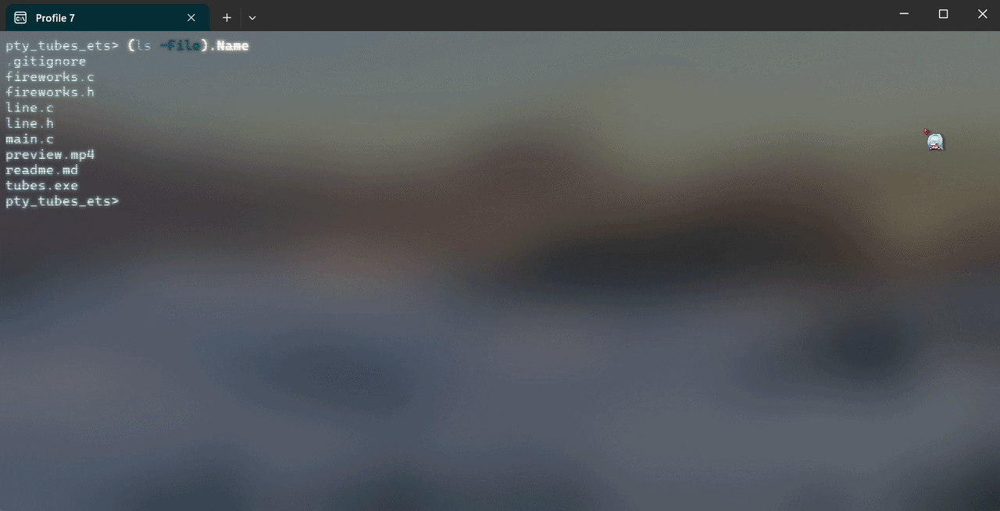

# RayKA-3
Nama: Fathin Yassarahman NIM: 241524041 Kelas:2B

## tentang
merupakan penugasan matakuliah grafika komputer praktek untuk UTS, menggunakan library raylib

### etimologi
`Ray` untuk Raylib, 
`KA` singkatan dari Kembang Api, program ini masih prototipe/blueprint/ide yang belum saya fix kan, maka dari itu ada `..-3` dijudul yang merupakan ide ke 2

if..

mungkin kedepannya jika saya menggunakan belum menemukan ide baru saya akan pakai yang ini saja

